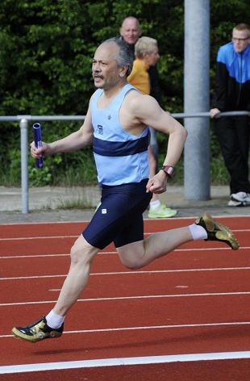

# Project 0

Web Programming with Python and JavaScript

## Peter's Track & Field page

Last week I failed to win a medal in the National Indoor Track&Field Championships for Masters (that is: elderly athletes).

It was the second time in a row that I missed out on the medals.
So it's probably time to write a warp-up about my Track&Field hobby (which I started almost 10 years ago).

For this project, I created a website consisting of 4 Web Pages:
- `Home`, the landing page
- `National Championships`, where I describe all my championship participations
- `Personal Bests`, where I list my personal bests per age category, plus my records
- `Volunteer`, where I list some of the track&field competitions in which I helped as a volunteer.

## Requirements

| Requirement                               | Description                                                                        |
| ----------------------------------------- | ---------------------------------------------------------------------------------- |
| 4 reachable html-pages                    | Each of the 4 pages can be reached from the menu at the top of each page.          |
| A list                                    | On the `Volunteer` page.                                                           |
| Tables                                    | On the `National Championships` page and on the `Personal Bests` page.             |
| Stylesheet with 5 properties              | More than 5 properties in the style.css file.                                      |
| 5 CSS selectors, including #id and .class | Element, Child, Class, ID, Descendant and Pseudoclass Selectors.                   |
| @media query                              | Used for sizing the pictures.                                                      |
| Bootstrap4 Component                      | I used a Bootstrap Jumbotron for the video on the `home` page.                     |
| Bootstrap Columns                         | Used in the `Personal Bests` page.                                                 |
| SCSS Variable                             | $zuidwal-dark and $zuidwal-light.                                                  |
| SCSS Nesting                              | Used in the Table styling.                                                         |
| SCSS Inheritance                          | Used in styling .gold, .silver and .bronze .                                       |
| A Readme.md file                          | You are currently reading it.                                                      |
| Screencast video on YouTube               | The screencast can be found at https://www.youtube.com/watch?v=tBxAepcw-oE.        |
